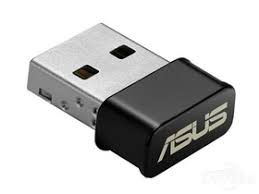

### 可移动外设

#### 无线网卡

一般台式机上网只能通过有线进行连接，笔记本则不需要。原因在于笔记本内置了无线网卡，而台式机基本没有内置无线网卡。在机房，我们的主机配上了无线网卡，所以可以跟笔记本一样联wifi上网

#### U盘

又称优盘，最早出现于本世纪初。

其产品定位是“便携式存储设备”，即为一种便于随身携带的用于存储数据的设备。与过去的其他便携式存储设备（特别是软盘）相比，U盘具有体积小、空间大、速度快、不易损坏等优点。

U盘可用作存储平时常用的各类文件，如文档、表格、视频、音乐等，亦可用于恢复损坏的电脑，引导安装操作系统，甚至能在其中创建一个完整的操作系统。

U盘的核心组成部分包括 USB 插头、闪存芯片、设备控制器和石英震荡器，其中闪存芯片和设备控制器的品质基本决定了U盘的性能和价格。

宜依次根据以下参数筛选：

1. 插头：USB Type A/C（PC, Mac）、Micro USB Type A/C（Android, Windows, Symbian）、Lightning（iOS）

2. 品牌：闪迪、东芝、金士顿、DIY等

3. 端口协议：USB 2.0 < USB 3.0 = USB 3.1 Gen 1 < USB 3.1 Gen 2（建议只考虑3.0及以后的U盘）

4. 速度：
   中高端产品连续读取速度常在 100M/s~400M/s，写入速度常在 60M/s 以上，4K读取速度常在 10M/s 以上，写入速度常在 1M/s 以上。（厂商通常只宣传连续读写速度，而4K读写速度也相当重要）

电商网站上一般会写清楚以上参数，进阶用户可以适当考虑以下亮点：

1. 闪存芯片： SLC > MLC > TLC，目前市面产品一般均采用 TLC 或 MLC（MLC为主）

2. 主控：群联、银灿、闪迪等…

   U盘格式化：建议格式化为exFAT格式，对U盘的性能寿命什么的更加友好。

